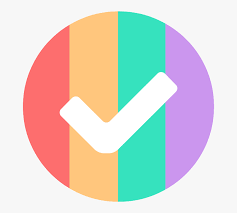

<a name="readme-top"></a>


<div align="center">
  <!-- You are encouraged to replace this logo with your own! Otherwise you can also remove it. -->
  
  <br/>

  <h3><b>To Do React</b></h3>

</div>

<!-- TABLE OF CONTENTS -->

# 📗 Table of Contents

- [📖 About the Project](#about-project)
    - [Tech Stack](#tech-stack)
    - [Key Features](#key-features)
- [💻 Getting Started](#getting-started)
  - [Setup](#setup)
  - [Prerequisites](#prerequisites)
  - [Install](#install)
  - [Run tests](#run-tests)
  - [Deployment](#deployment)
- [👥 Authors](#authors)
- [🔭 Future Features](#future-features)
- [🤝 Contributing](#contributing)
- [⭐️ Show your support](#support)
- [🙏 Acknowledgements](#acknowledgements)
- [📝 License](#license)

<!-- PROJECT DESCRIPTION -->

# 📖 Setup To Do List <a name="about-project"></a>

> "To-do list" is a tool that helps to organize your day. Built on react js.

## 🛠 Tech stack<a name="tech-stack"></a>
    React

<details>
  <summary>Client</summary>
  <ul>
    <li><a href="https://react.dev/">React</a></li>
  </ul>
</details>


<!-- Features -->

### Key Features <a name="key-features"></a>

- configured React
- React componeent to update the task status
- Reaact Component to clear all completed tasks 

<p align="right">(<a href="#readme-top">back to top</a>)</p>


<!-- GETTING STARTED -->

## 💻 Getting Started <a name="getting-started"></a>

To get a local copy up and running, follow these steps.

### Prerequisites

1- Web browser.
2- Code editor
3- Git
4- Node.js

### Setup

Clone this repository to your desired folder:

Run this command:

```sh
  cd my-folder
  git clone https://github.com/migo1/react-toDo.git
```

### Install

Install this project with:

Run this command:

```sh
  cd react-toDo
  npm install
```

### Run tests

You can run the tests using the following commands:

```
    npx stylelint "**/*.{css,scss}"
    run: npx eslint .
```
### Deployment

You can deploy this project using github pages.

<p align="right">(<a href="#readme-top">back to top</a>)</p>

<!-- AUTHORS -->

## 👥 Authors <a name="authors"></a>


👤 Kamran Asif

- GitHub: [@githubhandle](https://github.com/kamranasif506)
- Twitter: [@twitterhandle](https://twitter.com/kamiasif55)
- LinkedIn: [LinkedIn](https://www.linkedin.com/in/kamran-asif-76160926b/)


<p align="right">(<a href="#readme-top">back to top</a>)</p>

<!-- FUTURE FEATURES -->

## 🔭 Future Features <a name="future-features"></a>


- [ ] Drag and drop functionality to re-arrange the tasks.


<p align="right">(<a href="#readme-top">back to top</a>)</p>

<!-- CONTRIBUTING -->

## 🤝 Contributing <a name="contributing"></a>


Contributions, issues, and feature requests are welcome!

Feel free to check the [issues page](https://github.com/migo1/react-toDo/issues).

<p align="right">(<a href="#readme-top">back to top</a>)</p>

<!-- SUPPORT -->

## ⭐️ Show your support <a name="support"></a>

If you like this project just give it a star ⭐️. 

<p align="right">(<a href="#readme-top">back to top</a>)</p>

<!-- ACKNOWLEDGEMENTS -->

## 🙏 Acknowledgments <a name="acknowledgements"></a>

I would like to thank Microverse.

<p align="right">(<a href="#readme-top">back to top</a>)</p>

<!-- LICENSE -->

## 📝 License <a name="license"></a>

This project is [MIT](./LICENSE) licensed.

<p align="right">(<a href="#readme-top">back to top</a>)</p>